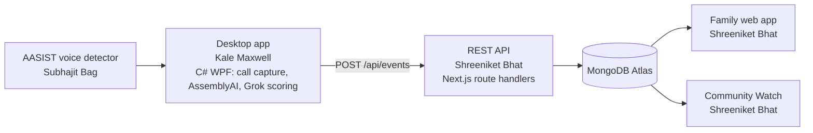

# ScamShield-AI

When a scam call hits, panic takes over. ScamShield stays on the line — telling you what to say, what to do, and when to hang up.


[Live demo](https://scamshield.tech) · [Pitch video](https://www.youtube.com/watch?v=sgjYvo5tX58) · [Devpost](https://devpost.com/software/scamshield-ai-1wag3o)

## The problem

Americans aged 60 and older lost $7.75 billion to fraud in 2025, up 59% from 2024 ([FBI IC3 2025 Elder Fraud Report](https://www.ic3.gov/AnnualReport/Reports/2025EFState/) — the same figures on the ScamShield landing page). Those scams isolate people on purpose, including AI voice clones that pretend to be family. Once the call is answered, the person on the phone is alone in the moment of decision.

## What it does

- **Live call monitoring and scam scoring.** On the older adult’s Windows laptop, the desktop app captures the call, transcribes it with AssemblyAI, and scores scam risk with Grok while the call is still going.
- **AI voice-clone detection.** An AASIST model scores whether the caller’s voice is synthetic and passes that score into the same risk check.
- **Real-time family verification.** A family phone shows a full-screen “Is this you?” prompt. “NOT me” is sent back so the person on the call can be told to hang up.
- **Community Watch.** Reports feed a dashboard of campaigns, an Atlanta ZIP map, a US map of FBI elder-fraud figures, and a Mutation Map of how a scam’s wording changes.


## Demo

| | |
| --- | --- |
| <br>One call on the family app: the outcome, what Grok told Nani, and the AssemblyAI transcript. | <br>Community Watch: campaigns spreading in Atlanta, and where reports are clustering. |
| <br>Elder-fraud losses and complaints by state, from the FBI IC3 2025 report. | <br>How one scam’s wording splits into variants. Positions in this demo are simulated. |

## Architecture



Vercel hosts the Next.js app: the API, the family app, and Community Watch. Raj Kumar Parihar led research, the pitch, and the presentation.

The desktop app posts call chunks during the call (AssemblyAI transcript so far, the voice-detector score, and Grok’s scam fields). The API can answer with a safe-word prompt, an “Is this you?” check, or a warning. The desktop then polls until the family answers. The shared shapes live in [`contract/CONTRACT.md`](contract/CONTRACT.md).

## Team & roles

| Name | Role |
| --- | --- |
| Shreeniket Bhat | Product and web lead: design spec, API contract, family web app, Community Watch dashboard, API and MongoDB, Vercel deployment, AI-agent build workflow |
| Kale Maxwell | C# desktop app: call monitoring, AssemblyAI and Grok integration, real-time on-call guidance |
| Subhajit Bag | AI voice-clone detector: AASIST and graph attention networks, 84% accuracy on test audio |
| Raj Kumar Parihar | Research, pitch, and presentation |

## How I built the web platform with AI agents

Four people were building at once, so the API was written down before the screens. [`contract/CONTRACT.md`](contract/CONTRACT.md) is the shared contract with the C# desktop app. [`docs/DESIGN_SPEC.md`](docs/DESIGN_SPEC.md) is the source of truth for the UI. [`docs/BUILD_PLAN.md`](docs/BUILD_PLAN.md) splits the web work into 8 phases and tells the agent to finish one phase, then stop.

I ran that plan in Cursor, using Grok and Claude models, one phase at a time. Each phase was reviewed against the spec and tested before the next one started. Early phases use in-browser mock data (`NEXT_PUBLIC_USE_MOCKS=true`) so a demo runs with no server; the API and MongoDB come in the last phase. The instructions the agents followed are in [`.cursor/rules/scamshield.mdc`](.cursor/rules/scamshield.mdc) and the `docs/` files above.

## Key engineering decisions

- **One Next.js project for UI and API.** Pages and route handlers live in `web/` and deploy together. Screens talk to the network only through `web/lib/api.ts`, so turning mocks off does not change the UI.
- **Contract-first integration with the C# app.** Circle and member IDs are fixed in the contract so the desktop app does not break when the web side changes.
- **Real-time verification by polling, plus a mock bus.** The family app polls `GET /api/verify/pending` every 2 seconds. In mock mode the same events travel on a `BroadcastChannel` named `scamshield`, so two browser tabs can run the demo with no server. With mocks off, pages refresh from the API every 5 seconds.
- **Privacy in the product rules.** Campaign text is redacted (dollar amounts and long numbers stripped). A ZIP code appears on the map only after 5 reports in the selected range. Circle settings never return the safe word. The endpoint that does return it requires an `X-Device-Token` header matching `DEVICE_TOKEN`.
- **Accessibility for older adults.** Family screens use 18px body text and 48px tap targets. Animations collapse when the system asks for reduced motion.

## Tech stack

| | |
| --- | --- |
| Frontend | Next.js 16.3, React 19.2, TypeScript 5, Tailwind CSS 4, lucide-react |
| Backend / data | Next.js route handlers, MongoDB Node driver 7 (MongoDB Atlas) |
| AI / ML | AssemblyAI (transcription), Grok `grok-4.3` via the xAI API (risk scoring), AASIST in Python (voice-clone detection, graph attention) |
| Visualization | Recharts, MapLibre GL, OpenFreeMap, d3-geo, d3-scale, topojson-client, us-atlas |
| Tooling | Cursor (Grok and Claude), ESLint, Vercel |

Versions match `web/package.json`. AssemblyAI, Grok, and AASIST are called by the desktop app and `ai_voice_detector/`, not by the web `package.json`.

## Data: what's real and what's simulated

**Real.** The US map and state table use FBI IC3 2025 elder-fraud figures for age 60+, one row per state, from [`web/lib/data/ic3ElderFraud2025.ts`](web/lib/data/ic3ElderFraud2025.ts). The contract marks `GET /api/community/states` as “Not demo data.”

**Simulated.** Atlanta campaigns, the ZIP map, the warning network, and Mutation Map positions are demo data (source `scamshield_atlanta_demo`, labelled “Demo data” in the UI). Map coordinates are a seeded layout, not live text embeddings. The national dollar totals on the landing page ($7.75B, +59% vs 2024) are the IC3 headline figures used in the app.

**Testing.** Every test used calls the team recorded and synthetic AI audio. There were no real users.

## Run it locally

From `web/`:

```bash
npm install
npm run dev
```

Put this in `web/.env.local` (that file is gitignored):

```bash
MONGODB_URI=your-atlas-connection-string
MONGODB_DB=scamshield
DEVICE_TOKEN=a-long-random-string
NEXT_PUBLIC_USE_MOCKS=true
```

Open [http://localhost:3000](http://localhost:3000). Family app: [http://localhost:3000/family](http://localhost:3000/family). Community Watch: [http://localhost:3000/community](http://localhost:3000/community).

`NEXT_PUBLIC_USE_MOCKS=true` uses in-browser demo data and does not need MongoDB. Omit it, or set it to anything other than `true`, to use the API. If `MONGODB_DB` is unset, the code uses the database name `kin`. `DEVICE_TOKEN` is the secret the desktop app sends when it needs the safe word.

The desktop app is Kale’s C# WPF project at the repo root, [`ScamDetector.csproj`](ScamDetector.csproj) (.NET 8, Windows). It posts to the API in [`contract/CONTRACT.md`](contract/CONTRACT.md). The voice detector is the Python package in [`ai_voice_detector/`](ai_voice_detector/).

## What's next

- On-device inference, so audio does not have to leave the laptop.
- Real text embeddings for the Mutation Map. The demo positions are a seeded layout.
- Phone support through carrier partnerships, beyond the WhatsApp desktop capture.
- A bank payment-hold integration, so a risky transfer can be paused at the bank.

---

Built in 36 hours at HackGT 13 (Georgia Tech, Sept 2026).
